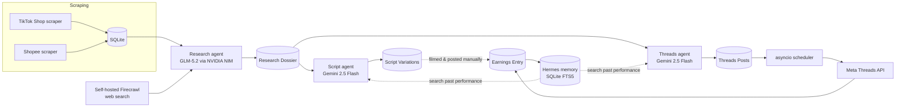

# AffiliateMint

<p align="center">
  
</p>


**An end-to-end affiliate marketing automation platform for the Malaysian TikTok Shop and Shopee affiliate markets.**

AffiliateMint scrapes trending products, researches them with AI, writes platform-native content, and publishes it — with a feedback loop that helps future content lean on what has actually worked before.


## Contents

- [Overview](#overview)
- [Features](#features)
- [Architecture](#architecture)
- [Tech stack](#tech-stack)
- [Project structure](#project-structure)
- [Getting started](#getting-started)
- [Environment variables](#environment-variables)
- [Running the app](#running-the-app)
- [Testing](#testing)
- [API overview](#api-overview)
- [Design notes](#design-notes)

## Overview

AffiliateMint automates the affiliate content pipeline for two Malaysian shopping platforms:

```
Scrape product → AI research dossier → Script / post generation → Publish → Log earnings → Memory feedback loop
```

- **TikTok Shop** products get a scraped listing, an AI research dossier, and 3 video script angles the operator reviews before filming.
- **Shopee** products get a scraped affiliate offer, an AI research dossier, and 3 Threads post variations that can be published immediately or scheduled.

Every stage is visible and editable on a Kanban-style board — nothing publishes without the operator's say, except Shopee's optional auto-publish mode.

## Features

- **Dual-platform scraping** — a SeleniumBase (UC mode) + Playwright-over-CDP hybrid scraper for TikTok Shop's storefront, and a paginated scraper for the Shopee affiliate dashboard, both using persisted browser sessions to survive anti-bot defenses.
- **AI research dossiers** — grounded strictly in scraped data plus optional web context from a self-hosted Firecrawl instance. An additive "deep research" pass adds category-specific credibility details (ingredients, fabric/material tech, brand heritage, certifications) without ever overwriting scraped facts.
- **Content generation** — 3 TikTok video script angles (Problem Hook, Tech Spec, Aesthetic/Lifestyle) or 3 Shopee Threads post variations, written in Bahasa Malaysia.
- **One-click pipeline** — scrape → research → scripts/posts runs as a single background job; the board polls `is_generating` and updates itself.
- **Editable outputs with memory** — every hand-edit and every logged earnings result is written into a local full-text search ledger (Hermes/FTS5) that future prompts query for "what worked before."
- **Threads publishing** — posts directly to Meta's Threads API, with automatic retries on transient failures and the exact API error surfaced back to the operator.
- **Post Queue** — schedule a Threads post to a specific hourly slot; a self-healing background poller publishes it when due, even after a server restart.
- **Dashboards** — a review board for new scrapes, a progress view grouped by date, and per-platform analytics (posts today, 7-day trend).

## Architecture



The two platforms diverge after the shared scrape → research stage: TikTok content stays manual (film → post → log earnings), while Shopee content is text-only and can publish straight from the app.

## Tech stack

| Layer | Technology |
|---|---|
| Backend API | FastAPI, SQLModel, SQLite (with an FTS5 memory ledger) |
| Background jobs | Native `asyncio` tasks and polling — no Celery/Redis/APScheduler |
| Scraping | SeleniumBase (UC mode) + Playwright over CDP |
| Research LLM | GLM-5.2 via NVIDIA NIM |
| Script/copy LLM | Gemini 2.5 Flash via Google AI Studio |
| Web grounding | Self-hosted [Firecrawl](https://github.com/mendableai/firecrawl) |
| Publishing | Meta Threads Graph API |
| Frontend | React, TypeScript, Vite, Tailwind CSS, Recharts |

## Project structure

The codebase is split by responsibility rather than by feature, so each layer can be reasoned about (and tested) on its own:

```
backend/
├── app/
│   ├── main.py             # FastAPI app wiring, CORS, router registration
│   ├── config.py            # Settings loaded from environment — the only file that reads os.environ
│   ├── db.py                 # Engine/session setup only, no business logic
│   ├── models.py             # SQLModel tables (persistence layer)
│   ├── schemas.py            # Response shapes that don't map 1:1 to a table
│   ├── routers/               # Thin HTTP layer — request/response only, no logic
│   ├── services/               # Business logic and state machines
│   └── mcp_tools/               # MCP tool wrappers for external agent access
├── agents/
│   ├── providers/                # One HTTP client per LLM provider (NVIDIA, Gemini, Firecrawl)
│   ├── research_agent.py          # Research dossier prompt + call
│   ├── deep_research_agent.py     # Optional "credibility section" pass
│   ├── script_agent.py            # TikTok script generation
│   ├── threads_agent.py           # Shopee Threads post generation
│   └── memory.py                  # FTS5 feedback ledger
├── scraper/
│   ├── config.py, browser.py, navigation.py, session_store.py, run.py   # TikTok Shop
│   └── shopee/                                                            # Shopee (mirrors the layout above)
└── tests/                    # pytest — pure logic, no live browser/LLM calls

frontend/
└── src/
    ├── api.ts                 # Typed fetch client — the only file that calls the backend
    ├── types.ts                # Shared TypeScript types
    ├── components/              # UI, one component per file
    └── lib/                       # Pure helper functions (formatting, grouping, status maps)
```

> [!NOTE]
> `app/routers` never contains business logic — it validates the request and delegates to `app/services`. This keeps the HTTP layer swappable and the logic testable without spinning up FastAPI.

## Getting started

### Prerequisites

- Python 3.11+
- Node.js 18+
- Google Chrome (required by SeleniumBase's UC mode)
- An LLM endpoint compatible with the OpenAI chat-completions schema for Hermes' memory calls (defaults to `http://localhost:8080`)
- API keys for NVIDIA NIM (research) and Google AI Studio (scripts/posts)
- A self-hosted or hosted [Firecrawl](https://github.com/mendableai/firecrawl) instance for web-grounded research (defaults to `http://localhost:3002`)
- Meta Threads API credentials, only needed for publishing (`threads_user_id`, `threads_access_token`)

### Installation

```bash
git clone <repository-url>
cd affiliatemint

# Backend
cd backend
python -m venv .venv && source .venv/bin/activate
pip install -r requirements.txt
playwright install chromium

# Frontend
cd ../frontend
npm install
```

### Capture scraper sessions

Both scrapers rely on a saved, logged-in browser session rather than a fresh incognito profile per run — this is what lets them survive TikTok's/Shopee's bot defenses. Run these once (and again whenever a session expires):

```bash
# from backend/
python3 -m scraper.manual_capture_session          # TikTok Shop
python3 -m scraper.shopee.manual_capture_session    # Shopee affiliate dashboard
```

Each opens a visible browser window and gives you ~45 seconds to browse/log in before saving cookies to disk.

## Environment variables

Set these in `backend/.env` (all have safe local-dev defaults except the API keys):

| Variable | Default | Purpose |
|---|---|---|
| `DATABASE_URL` | `sqlite:///./tiktok_engine.db` | Main application database |
| `HERMES_API_URL` / `HERMES_API_KEY` | `http://localhost:8080` | Local memory-ledger LLM endpoint |
| `NVIDIA_API_KEY` / `NVIDIA_MODEL` | — | Research agent (GLM-5.2 via NVIDIA NIM) |
| `GEMINI_API_KEY` / `GEMINI_MODEL` | — | Script and Threads agents |
| `FIRECRAWL_API_BASE` / `FIRECRAWL_API_KEY` | `https://api.firecrawl.dev/v1` | Web-search grounding; point at `http://localhost:3002/v1` for self-hosted, no key required |
| `THREADS_USER_ID` / `THREADS_ACCESS_TOKEN` | — | Required only for publishing to Threads |
| `AUTO_PUBLISH_SHOPEE_THREADS` | `false` | Skips manual review and publishes the first generated Threads post automatically |
| `SCRAPER_HEADLESS` | `true` | Run scrapers without a visible browser window |

> [!WARNING]
> Enabling `AUTO_PUBLISH_SHOPEE_THREADS` publishes generated content to a live Threads account with no human review step — only turn this on once you trust the output quality.

## Running the app

```bash
# Backend — from backend/
uvicorn app.main:app --reload --port 8000

# Frontend — from frontend/
npm run dev
```

The frontend expects the API at `/api` and is configured for `http://localhost:5173` in the backend's CORS settings. On first run, FastAPI's startup hook creates `tiktok_engine.db` and starts the Post Queue's background scheduler automatically.

> [!TIP]
> `create_all` never applies schema migrations. In development, delete `tiktok_engine.db` and restart whenever a model gains a new column; for anything longer-lived, apply the change with `ALTER TABLE` via the `sqlite3` CLI instead.

## Testing

```bash
cd backend
python -m pytest
```

Tests run against an in-memory SQLite database and monkeypatch every LLM/browser call, so no live credentials or network access are needed — they check pipeline state transitions and scraper response parsing, not AI output quality.

## API overview

All routes are mounted under `/api`.

| Resource | Base path | Purpose |
|---|---|---|
| Products | `/products` | List scraped products, trigger the one-click pipeline |
| Scraper | `/scraper` | Run the TikTok scraper, clear un-reviewed scrapes |
| Shopee | `/shopee` | Run the Shopee affiliate scraper |
| Research | `/research` | Generate/list research dossiers |
| Scripts | `/scripts` | Generate, edit, and select TikTok script variations |
| Cards | `/cards` | Kanban board state and status transitions |
| Threads | `/threads` | Generate, edit, publish, and schedule Threads posts; Post Queue endpoints |
| Earnings | `/earnings` | Log and review manual performance entries |
| Dashboard | `/dashboard` | Aggregate summary stats |

## Design notes

A few deliberate constraints worth knowing before extending this project:

- **No task queue.** Background work (the pipeline, the Post Queue) runs on plain `asyncio` tasks polling the database by absolute due-time. This is simpler than Celery/Redis for a single-instance, solo-operated app, and it's self-healing — a missed tick from a restart just gets picked up on the next poll.
- **Deep research is additive, never destructive.** `ingredients_research` is a separate field from the scraped price/rating/units-sold data; it is never allowed to overwrite what was actually scraped.
- **Firecrawl is used for grounding, not scraping the target platforms.** Firecrawl blocks TikTok outright and returns a login wall for Shopee, so product data always comes from the dedicated browser scrapers — Firecrawl's `/search` only supplies general market context.
- **Hermes' "memory" is a keyword index, not a trained model.** It's an FTS5 full-text search over past scripts/posts and their logged performance — an honest, inspectable feedback mechanism rather than fine-tuning.
